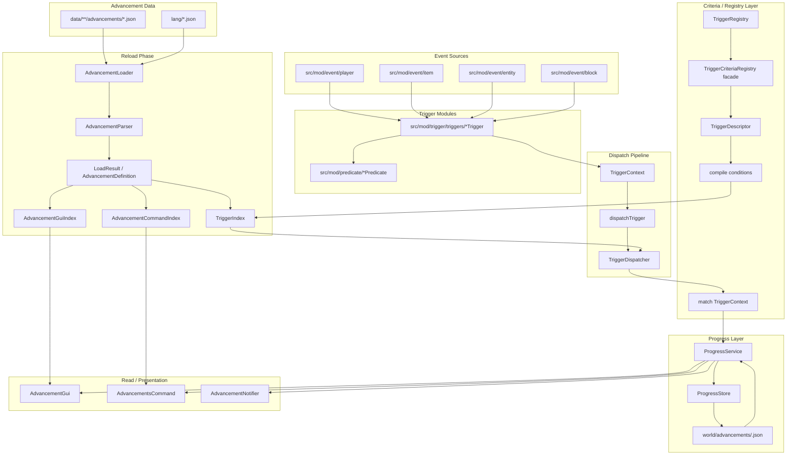
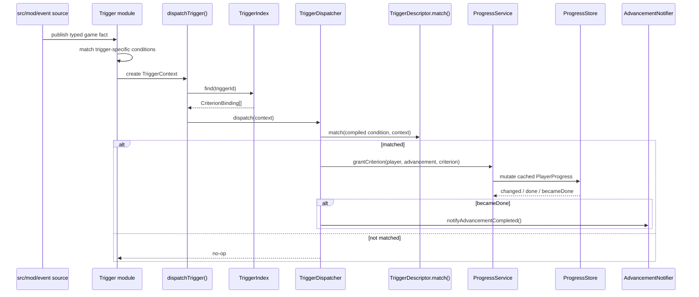
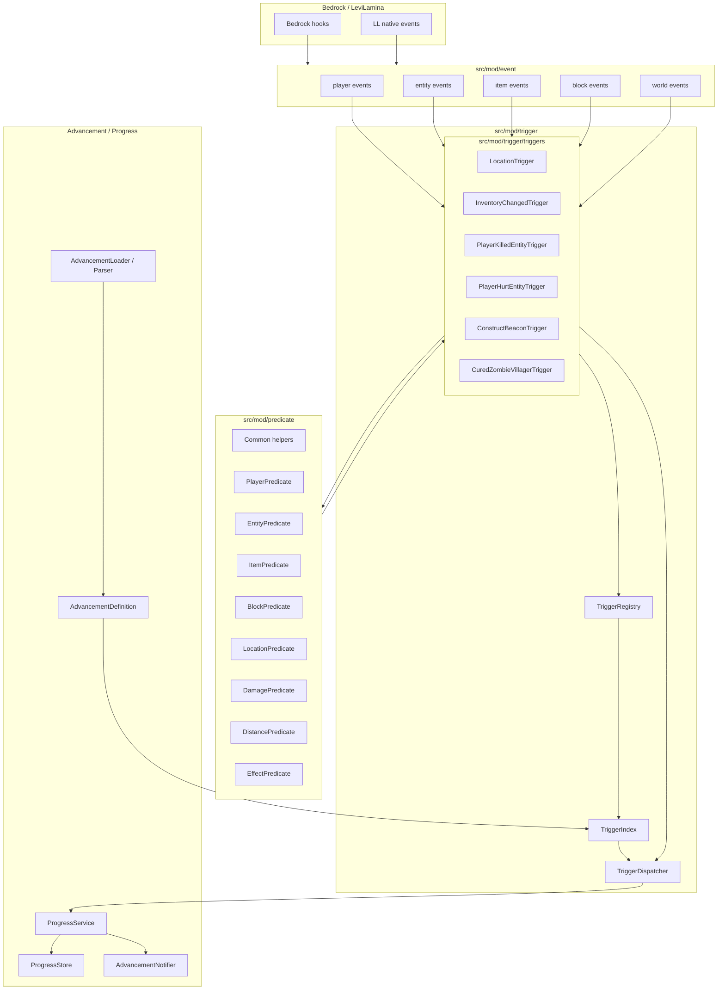
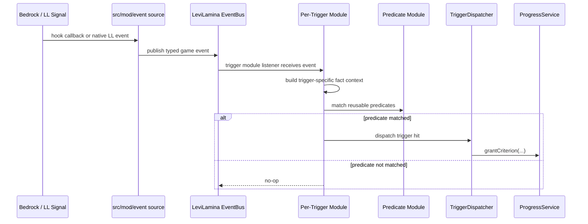
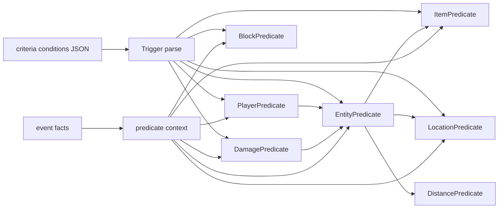
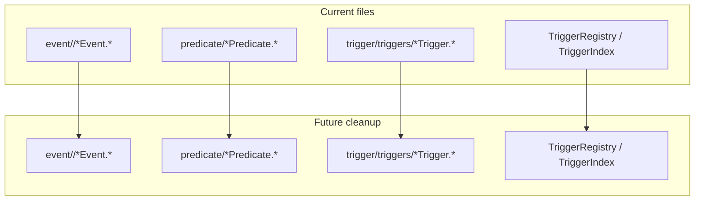

# Advancements Architecture

This document keeps both the current architecture and the proposed target architecture for future refactor and optimization waves.

## Current Architecture

The current implementation is reload-centered. Advancement JSON is parsed on reload, indexes are rebuilt, plugin-owned event sources publish typed game facts, trigger modules create `TriggerContext`, and `TriggerDispatcher` grants progress through `ProgressService`.



### Current Runtime Trigger Flow



### Current Pain Points

- The old `trigger/runtime/*` layer has been removed; keep future runtime seams in `src/mod/event/**` and trigger-specific logic in `src/mod/trigger/triggers/**`.
- `trigger/criteria/*` remains descriptor-facing glue and should not regain reusable vanilla/wiki predicate parsing that now belongs in `src/mod/predicate/**`.
- `TriggerIndex.h` still stores compiled descriptor-backed bindings; avoid expanding compatibility variants unless a concrete advancement requires it.
- Common predicate shapes such as player, entity, item, block, location, distance, and damage should stay centralized in predicate helpers.

## Target Architecture

The target architecture separates game event sourcing, reusable predicate parsing/matching, and per-trigger modules.



### Target Runtime Flow



## Target Directory Shape

```text
src/mod/
  event/
    player/
    entity/
    item/
    block/
    world/

  predicate/
    Common.*
    EntityPredicate.*
    PlayerPredicate.*
    ItemPredicate.*
    BlockPredicate.*
    LocationPredicate.*
    DamagePredicate.*
    DistancePredicate.*
    EffectPredicate.*

  trigger/
    TriggerRegistry.*
    TriggerDispatcher.*
    TriggerIndex.*
    TriggerModule.*
    triggers/
      InventoryChangedTrigger.*
      ConsumeItemTrigger.*
      LocationTrigger.*
      LevitationTrigger.*
      ChangedDimensionTrigger.*
      PlayerKilledEntityTrigger.*
      PlayerHurtEntityTrigger.*
      ConstructBeaconTrigger.*
      CuredZombieVillagerTrigger.*
```

## Layer Boundaries

### Event Layer

Owns:

- Existing LL event subscriptions.
- Bedrock hooks when LL has no native event.
- Typed game events grouped by player, entity, item, block, and world.
- Stable payload extraction from raw game objects.

Must not own:

- Advancement IDs.
- Criterion IDs.
- Trigger IDs.
- JSON condition parsing.
- Predicate matching.
- Progress mutation or persistence.

### Predicate Layer

Owns:

- Wiki/vanilla-style predicate parsing.
- Reusable predicate matching for player, entity, item, block, location, damage, distance, and effects.
- Small predicate context objects assembled by trigger modules from events.

Must not own:

- Event registration.
- Trigger registration.
- Advancement progress mutation.
- Trigger-specific dispatch timing.

### Trigger Layer

Owns:

- Trigger IDs.
- Per-trigger condition parsing.
- Per-trigger event subscriptions.
- Per-trigger state such as location polling cadence, levitation start positions, or cure-tracking ownership where a Bedrock seam still needs trigger-local state.
- Mapping event payloads into predicate contexts.
- Calling `dispatchTrigger` or the future dispatcher entry point when a trigger is satisfied.

Must not own:

- Bedrock hook mechanics.
- Raw LL event adaptation.
- Duplicated player/item/block/location predicate parsing.
- Progress persistence.

## Predicate Reuse Model



Examples:

- `minecraft:location` parses `conditions.player` through `PlayerPredicate`, which can reuse `EntityPredicate` and `LocationPredicate`.
- `minecraft:target_hit` parses `conditions.projectile` through `EntityPredicate`, which can reuse `DistancePredicate`.
- `minecraft:player_hurt_entity` parses `conditions.damage` through `DamagePredicate`, which can reuse `EntityPredicate` for `direct_entity`.
- `minecraft:villager_trade` parses player location constraints through `PlayerPredicate` and `LocationPredicate`.

## Migration Map



Current post-0.1.2 state:

1. `trigger/runtime/*` has been removed from the current source tree.
2. Existing migrated triggers consume plugin-owned events from `src/mod/event/**`.
3. Reusable predicate helpers live under `src/mod/predicate/**`.
4. Trigger descriptors are registered through `TriggerRegistry` while `TriggerIndex` and `TriggerDispatcher` still own reload-time binding and grant dispatch.
5. Future work should add one concrete event/trigger slice at a time and avoid broad generic trigger scaffolding.

## Stable Rules

- Event layer describes game facts only.
- Predicate layer parses and matches reusable wiki/vanilla predicates only.
- Trigger modules listen to events, compose predicates, and dispatch trigger hits.
- Dispatcher and progress layers continue to own criterion grant, completion notification, and persistence.
- Do one trigger migration wave at a time.
