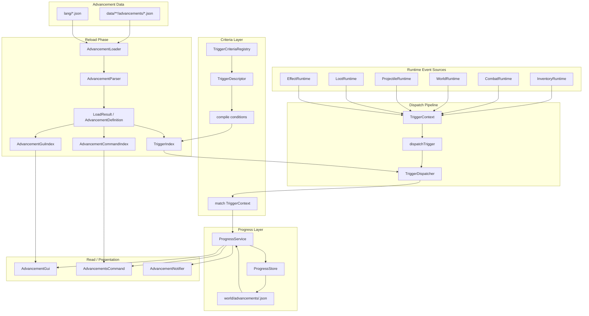
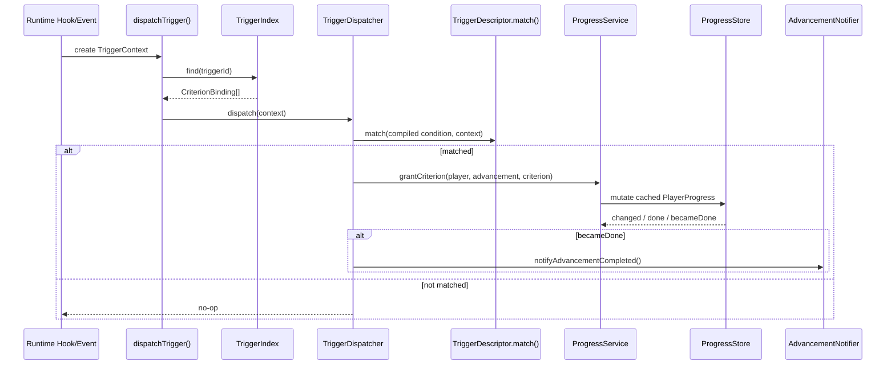
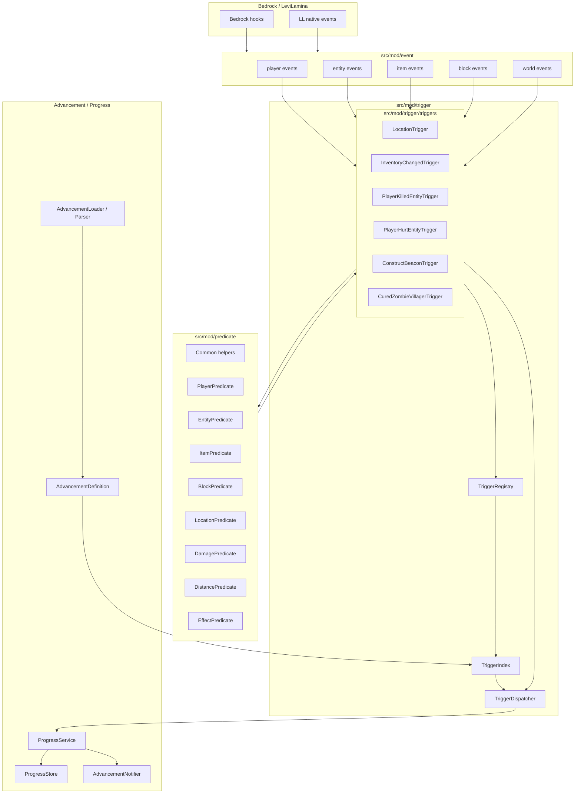
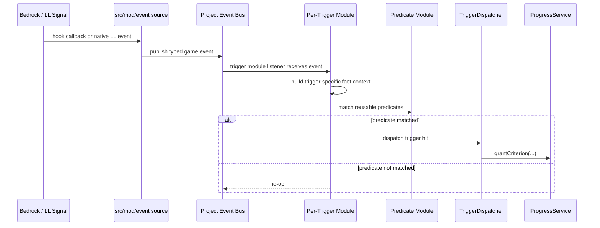
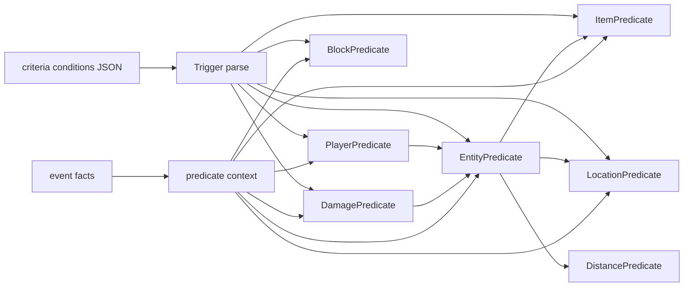
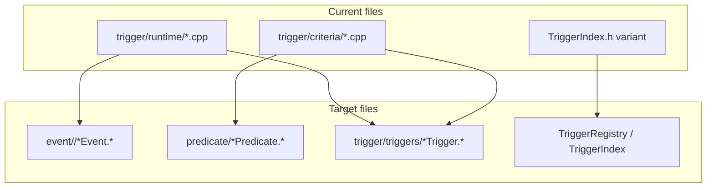

# Advancements Architecture

This document keeps both the current architecture and the proposed target architecture for future refactor and optimization waves.

## Current Architecture

The current implementation is reload-centered. Advancement JSON is parsed on reload, indexes are rebuilt, runtime hooks/events create `TriggerContext`, and `TriggerDispatcher` grants progress through `ProgressService`.



### Current Runtime Trigger Flow



### Current Pain Points

- `trigger/runtime/*` mixes hook registration, LL event consumption, game-fact extraction, trigger-specific state, and `dispatchTrigger` calls.
- `trigger/criteria/*` mixes trigger condition parsing with reusable vanilla/wiki predicate parsing.
- `TriggerIndex.h` owns a growing `TriggerPayload` / `TriggerCondition` variant that becomes harder to extend as more triggers are added.
- Common predicate shapes such as player, entity, item, block, location, distance, and damage are repeated across trigger-specific criteria files.

## Target Architecture

The target architecture separates game event sourcing, reusable predicate parsing/matching, and per-trigger modules.



### Target Runtime Flow



## Target Directory Shape

```text
src/mod/
  event/
    player/
    entity/
    item/
    block/
    world/

  predicate/
    Common.*
    EntityPredicate.*
    PlayerPredicate.*
    ItemPredicate.*
    BlockPredicate.*
    LocationPredicate.*
    DamagePredicate.*
    DistancePredicate.*
    EffectPredicate.*

  trigger/
    TriggerRegistry.*
    TriggerDispatcher.*
    TriggerIndex.*
    TriggerModule.*
    triggers/
      InventoryChangedTrigger.*
      ConsumeItemTrigger.*
      LocationTrigger.*
      LevitationTrigger.*
      ChangedDimensionTrigger.*
      PlayerKilledEntityTrigger.*
      PlayerHurtEntityTrigger.*
      ConstructBeaconTrigger.*
      CuredZombieVillagerTrigger.*
```

## Layer Boundaries

### Event Layer

Owns:

- Existing LL event subscriptions.
- Bedrock hooks when LL has no native event.
- Typed game events grouped by player, entity, item, block, and world.
- Stable payload extraction from raw game objects.

Must not own:

- Advancement IDs.
- Criterion IDs.
- Trigger IDs.
- JSON condition parsing.
- Predicate matching.
- Progress mutation or persistence.

### Predicate Layer

Owns:

- Wiki/vanilla-style predicate parsing.
- Reusable predicate matching for player, entity, item, block, location, damage, distance, and effects.
- Small predicate context objects assembled by trigger modules from events.

Must not own:

- Event registration.
- Trigger registration.
- Advancement progress mutation.
- Trigger-specific dispatch timing.

### Trigger Layer

Owns:

- Trigger IDs.
- Per-trigger condition parsing.
- Per-trigger event subscriptions.
- Per-trigger state such as location polling cadence or levitation start positions.
- Mapping event payloads into predicate contexts.
- Calling `dispatchTrigger` or the future dispatcher entry point when a trigger is satisfied.

Must not own:

- Bedrock hook mechanics.
- Raw LL event adaptation.
- Duplicated player/item/block/location predicate parsing.
- Progress persistence.

## Predicate Reuse Model



Examples:

- `minecraft:location` parses `conditions.player` through `PlayerPredicate`, which can reuse `EntityPredicate` and `LocationPredicate`.
- `minecraft:target_hit` parses `conditions.projectile` through `EntityPredicate`, which can reuse `DistancePredicate`.
- `minecraft:player_hurt_entity` parses `conditions.damage` through `DamagePredicate`, which can reuse `EntityPredicate` for `direct_entity`.
- `minecraft:villager_trade` parses player location constraints through `PlayerPredicate` and `LocationPredicate`.

## Migration Map



Recommended first wave:

1. Add `event/player/PlayerTickEvent.*` as the event-source seam for `Player::$tickWorld`.
2. Add minimal `predicate/PlayerPredicate.*` and `predicate/LocationPredicate.*` for the currently supported `player[0].predicate.location.structures` shape.
3. Move `minecraft:location` into `trigger/triggers/LocationTrigger.*` as the first per-trigger module.
4. Keep `TriggerDispatcher` and `ProgressService` behavior unchanged.
5. Verify the same trigger IDs, same player attribution, same 20-tick cadence, and same advancement completion behavior before migrating another trigger.

## Stable Rules

- Event layer describes game facts only.
- Predicate layer parses and matches reusable wiki/vanilla predicates only.
- Trigger modules listen to events, compose predicates, and dispatch trigger hits.
- Dispatcher and progress layers continue to own criterion grant, completion notification, and persistence.
- Do one trigger migration wave at a time.
