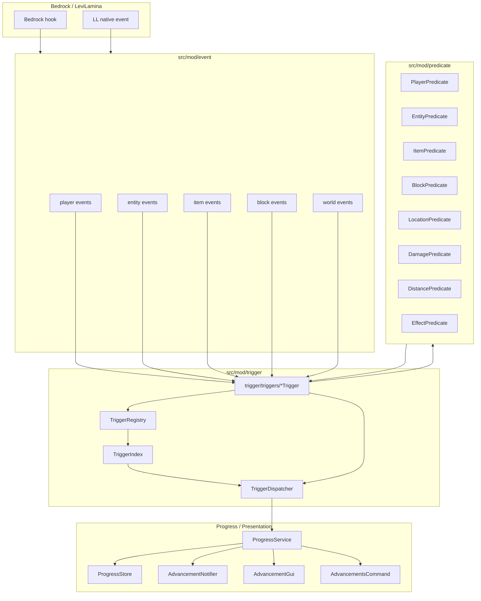
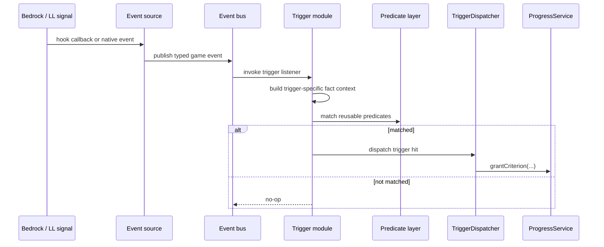

# Advancements Target Trigger Architecture Design

## Purpose

This document defines the target trigger architecture for the Advancements plugin. It is a design document, not an implementation wave. The goal is to make future advancement trigger work easier to read, safer to migrate, and closer to vanilla/wiki predicate structure while preserving the current reload-centered progress pipeline.

## Summary

The target architecture splits the current `trigger/runtime` and `trigger/criteria` responsibilities into three explicit layers:

```text
src/mod/event       -> game fact event sources
src/mod/predicate   -> reusable wiki/vanilla predicate parsing and matching
src/mod/trigger     -> per-trigger modules that listen, parse, match, and dispatch
```

The central rule is:

```text
Event layer describes what happened.
Predicate layer answers whether facts satisfy common predicates.
Trigger layer decides whether a Minecraft advancement trigger fired.
Progress layer still grants, notifies, and persists.
```

## Non-Goals

- Do not rewrite all existing triggers in one wave.
- Do not move progress persistence into trigger modules.
- Do not make event sources know about advancement IDs, criterion names, trigger IDs, or JSON conditions.
- Do not make predicates subscribe to events or dispatch progress.
- Do not implement complete vanilla predicate coverage before a concrete advancement row needs it.
- Do not reintroduce broad legacy trigger matching.


## Phase 1 Concrete Decisions

These decisions remove ambiguity for the first implementation wave. Later waves may revise them only after Phase 1 is verified.

### Event Dispatch Choice

Phase 1 defines plugin-owned typed events under `src/mod/event` and publishes them through LeviLamina's `ll::event::EventBus` using the same custom-event shape as LeviLamina itself: event classes derive from `ll::event::Event`, hooks create a concrete event object, and consumers register `ll::event::ListenerPtr` handles with `emplaceListener`.

This keeps event ownership in the plugin while reusing the existing LeviLamina listener lifecycle instead of introducing a second project-local event bus. Existing LL events may still be consumed directly by event sources.

### Player Tick Compatibility

`Player::$tickWorld` originally drove both `minecraft:location` and `minecraft:levitation`. Phase 1 moved the raw hook into `event/player/PlayerTickEvent.*`, then wired two consumers:

- `trigger/triggers/LocationTrigger.*` consumes `PlayerTickEvent` for migrated location logic.
- `trigger/triggers/LevitationTrigger.*` now consumes the same `PlayerTickEvent` for the migrated levitation path.

The old world runtime must not keep a second `Player::$tickWorld` hook after the event source owns that hook. This prevents duplicate hooks. The temporary compatibility concern described here was resolved once `minecraft:levitation` was migrated into `trigger/triggers/LevitationTrigger.*`.

### Registry Compatibility

Phase 1 does not introduce the final `TriggerRegistry` abstraction. The migrated `minecraft:location` parser/matcher can live with `LocationTrigger`, but it must still be visible to the current `TriggerCriteriaRegistry` / `TriggerIndex` path. The dispatcher and progress grant path remain unchanged.

The full `TriggerRegistry` cleanup belongs to a later registry/variant cleanup wave, after at least one migrated trigger has proven the new event and predicate boundaries.

### Predicate API Compatibility

Phase 1 does not introduce a project-wide `PredicateResult` or type-erased compiled predicate framework. Predicate modules should expose narrow helpers for the currently supported shapes and bridge back into the current `TriggerCondition` compatibility structs.

For `minecraft:location`, this means parsing only the existing `player[0].predicate.location.structures` shape and matching it against the sampled structure fact. Unsupported shapes must fail closed.

## Current Problem

The current code works, but its responsibilities are becoming crowded:

- `trigger/runtime/*.cpp` files mix hook registration, LL event consumption, game-fact extraction, trigger-specific state, and calls to `dispatchTrigger`.
- `trigger/criteria/*.cpp` files mix trigger-specific condition parsing with reusable vanilla/wiki predicate parsing.
- `TriggerIndex.h` carries a growing `TriggerPayload` and `TriggerCondition` variant.
- Common shapes such as `entity_properties`, `player`, `item`, `block`, `location`, `distance`, and `damage` are parsed directly inside individual criteria files.

This is manageable now, but it will become harder as broader Adventure and Husbandry rows require more shared predicate coverage.

## Target Architecture Diagram



## Runtime Flow



## Directory Layout

```text
src/mod/
  event/
    player/
      PlayerTickEvent.*
      PlayerChangedDimensionEvent.*
      PlayerInteractedWithEntityEvent.*
    entity/
      EntityHurtEvent.*
      EntityKilledEvent.*
      EntityTransformedEvent.*
    item/
      ItemConsumedEvent.*
      ContainerOutputTakenEvent.*
      BucketFilledEvent.*
    block/
      BlockUsedEvent.*
      TargetBlockHitEvent.*
      BeaconLevelChangedEvent.*
    world/
      StructureSampleEvent.*
      DragonRespawnEvent.*

  predicate/
    Common.*
    PredicateResult.*          # reserved for later waves; do not require in Phase 1
    PlayerPredicate.*
    EntityPredicate.*
    ItemPredicate.*
    BlockPredicate.*
    LocationPredicate.*
    DamagePredicate.*
    DistancePredicate.*
    EffectPredicate.*

  trigger/
    TriggerModule.*
    TriggerRegistry.*
    TriggerIndex.*
    TriggerDispatcher.*
    TriggerDispatch.*          # wrapper around current dispatchTrigger, introduced only when needed
    triggers/
      LocationTrigger.*
      LevitationTrigger.*
      InventoryChangedTrigger.*
      ConsumeItemTrigger.*
      ChangedDimensionTrigger.*
      PlayerKilledEntityTrigger.*
      PlayerHurtEntityTrigger.*
      EntityHurtPlayerTrigger.*
      TargetHitTrigger.*
      ConstructBeaconTrigger.*
      CuredZombieVillagerTrigger.*
```

The exact filenames can evolve. The important part is the dependency direction.

## Layer Contracts

### Event Layer

The event layer owns raw game signal adaptation.

Allowed responsibilities:

- Subscribe to existing LL events.
- Register Bedrock hooks when LL does not expose a suitable event.
- Extract stable facts from raw game objects.
- Publish typed project events grouped by player, entity, item, block, and world.
- Keep hook registration and unregistration lifecycle isolated.

Forbidden responsibilities:

- Advancement ID knowledge.
- Criterion name knowledge.
- Trigger ID knowledge.
- Advancement JSON parsing.
- Predicate parsing or matching.
- `dispatchTrigger` calls.
- Progress grant, notification, or persistence.

Event payloads should describe game facts. Good examples:

```text
PlayerTickEvent
PlayerChangedDimensionEvent
EntityHurtEvent
EntityKilledEvent
ContainerOutputTakenEvent
BeaconLevelChangedEvent
TargetBlockHitEvent
```

Avoid advancement-shaped event names:

```text
LocationAdvancementEvent
ConstructBeaconTriggerEvent
PlayerKilledEntityCriterionEvent
```

### Predicate Layer

The predicate layer owns reusable vanilla/wiki predicate parsing and matching.

Allowed responsibilities:

- Parse supported JSON predicate shapes into typed predicate objects.
- Match typed predicate objects against small fact contexts.
- Compose predicates where vanilla semantics nest them.
- Return invalid/unsupported parse results for shapes the project has not implemented.

Forbidden responsibilities:

- Event subscription.
- Bedrock hook registration.
- Trigger registration.
- Trigger dispatch.
- Progress mutation or persistence.

Initial predicate modules should be narrow and evidence-driven:

```text
PlayerPredicate
  - entity_properties wrapper for entity = this
  - location predicate delegation
  - future: effects, equipment, flags, vehicle, distance

EntityPredicate
  - type
  - type_specific.frog.variant
  - distance delegation

ItemPredicate
  - items / item ID
  - count where already supported
  - future: tags, components, enchantments

BlockPredicate
  - block ID
  - future: state and NBT-like shapes if available

LocationPredicate
  - structures
  - position.y.min
  - future: biome, dimension, full position ranges

DamagePredicate
  - blocked projectile damage
  - direct_entity.type
  - direct_entity.equipment.mainhand.items
  - damage tags used by current rows
  - dealt.min

DistancePredicate
  - horizontal.min
  - future: absolute/x/y/z ranges

EffectPredicate
  - required effect IDs
  - project-supported Bedrock effect aliases
```

### Trigger Layer

The trigger layer owns Minecraft advancement trigger behavior.

Allowed responsibilities:

- Declare trigger ID.
- Parse trigger-specific condition JSON.
- Delegate common JSON shapes to predicate modules.
- Register itself with `TriggerRegistry`.
- Listen to project events from `src/mod/event`.
- Maintain trigger-specific state such as polling cadence, last structure, or levitation start position.
- Build predicate fact contexts from event payloads.
- Call the dispatcher entry point when a criterion should be considered satisfied.

Forbidden responsibilities:

- Bedrock hook mechanics.
- Raw LL event adaptation.
- Re-implementing player/item/block/location/damage predicate parsing.
- Saving progress JSON.
- Sending completion notifications directly.

## Trigger Module Shape

A target trigger module should be internally cohesive and externally narrow.

Conceptual shape:

```cpp
namespace advancements::triggers::location {

struct Condition {
    predicate::PlayerPredicate player;
};

ParseResult<Condition> parse(nlohmann::json const& conditions);
bool matches(Condition const& condition, LocationFacts const& facts);
void registerTrigger(TriggerRegistry& registry, event::EventBus& events, TriggerDispatch& dispatch);

}
```

The exact C++ API can differ, but each module should answer:

- What trigger ID do I implement?
- What conditions do I parse?
- Which event(s) do I listen to?
- Which predicates do I reuse?
- What state do I keep?
- When do I dispatch a trigger hit?

## Predicate Reuse Examples

### `minecraft:location`

```text
LocationTrigger
  conditions.player
    -> PlayerPredicate
      -> EntityPredicate
        -> LocationPredicate(structures)
```

Runtime facts:

```text
PlayerTickEvent or StructureSampleEvent
  -> player
  -> current supported structure ID
```

### `minecraft:target_hit`

```text
TargetHitTrigger
  conditions.projectile
    -> EntityPredicate
      -> DistancePredicate(horizontal.min)
```

Runtime facts:

```text
TargetBlockHitEvent
  -> projectile owner player
  -> projectile horizontal distance
  -> redstone signal strength
```

### `minecraft:player_hurt_entity`

```text
PlayerHurtEntityTrigger
  conditions.damage
    -> DamagePredicate
      -> EntityPredicate(direct_entity)
```

Runtime facts:

```text
EntityHurtEvent
  -> hurting player
  -> hurt entity
  -> direct damager
  -> projectile tag support
  -> damage dealt
```

### `minecraft:villager_trade`

```text
VillagerTradeTrigger
  conditions.player
    -> PlayerPredicate
      -> LocationPredicate(position.y.min)
```

Runtime facts:

```text
TradeCompletedEvent
  -> player
  -> player position
```

## Registry and Index Strategy

The current `TriggerIndex` can remain during migration. New trigger modules should not require an immediate big-bang replacement.

Recommended transition:

1. Keep current descriptor-based `TriggerIndex` as the compatibility path.
2. Add `TriggerRegistry` as the new registration surface for per-trigger modules.
3. Let migrated triggers register parse/match handlers through `TriggerRegistry`.
4. Let unmigrated triggers continue through the existing descriptor registry.
5. Once enough triggers migrate, reduce or remove the old large `TriggerCondition` variant.

During migration, behavior compatibility is more important than immediate API purity.

## Lifecycle

Suggested lifecycle after migration:

```text
Entry::enable()
  -> reloadAdvancements()
  -> registerEventSources()
  -> registerTriggerModules()

Entry::disable()
  -> unregisterTriggerModules()
  -> unregisterEventSources()
  -> flush progress
```

Reload should rebuild definitions and trigger indexes. Event source registration should not depend on advancement JSON. Trigger module registration can be stable across reloads, but parsed trigger bindings must refresh when definitions reload.

## Performance Principles

- Event sources should be as cheap as possible.
- High-frequency events must avoid JSON parsing, string formatting, and broad scans.
- Predicate objects must be compiled on reload, not parsed at event time.
- Trigger modules should fast-return when their trigger has no loaded bindings.
- Stateful triggers should use narrow cadence controls, such as the existing 20-tick location check.
- Debug logging in hot paths must be gated.

## Compatibility Rules

- Same trigger ID before and after migration.
- Same player attribution before and after migration.
- Same advancement criterion grant behavior before and after migration.
- Same live-server caveats remain documented until separately proven.
- No trigger migration may broaden semantics without verified vanilla JSON and runtime evidence.

## Recommended First Reference Implementation

Use `minecraft:location` as the first reference migration because it exercises all important new layers without touching many unrelated trigger families:

```text
src/mod/event/player/PlayerTickEvent.*
src/mod/predicate/PlayerPredicate.*
src/mod/predicate/LocationPredicate.*
src/mod/trigger/triggers/LocationTrigger.*
```

Expected retained behavior:

- Still checks supported structures on a controlled cadence.
- Still dispatches only supported narrow structure rows.
- Still uses the same player attribution.
- Still grants through `TriggerDispatcher` and `ProgressService`.
- Does not migrate unrelated world triggers in the same wave.

## Deferred Design Decisions

These are intentionally deferred beyond Phase 1. Do not resolve them during the first `minecraft:location` migration unless the phase cannot compile without a narrow local choice:

- Final `TriggerRegistry` API and its long-term relationship with `TriggerIndex`.
- Final ownership type for compiled trigger conditions after enough triggers have migrated.
- Whether migrated trigger modules keep legacy descriptor names after the compatibility period.
- Whether later waves introduce additional plugin-owned custom events or keep some seams as direct LL event listeners.
- How much broad documentation synchronization is done after the architecture is proven.

Already-decided Phase 1 items are not open decisions: publish plugin-owned events through LeviLamina custom-event/EventBus patterns, keep `minecraft:location` visible through the current `TriggerCriteriaRegistry` / `TriggerIndex` path, and avoid a global `PredicateResult` framework.


